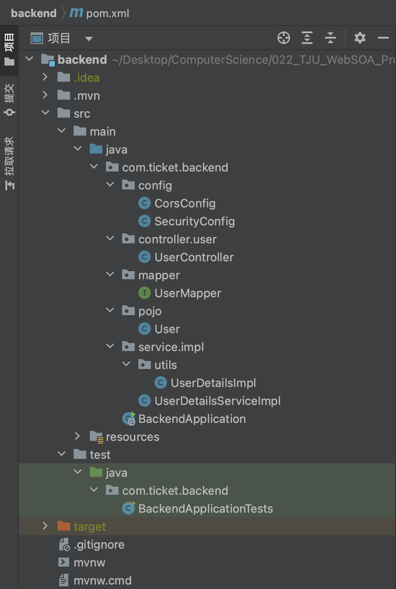
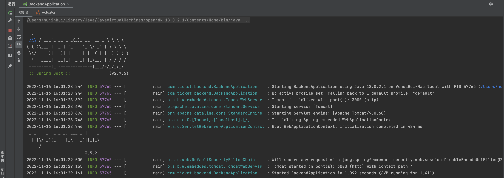
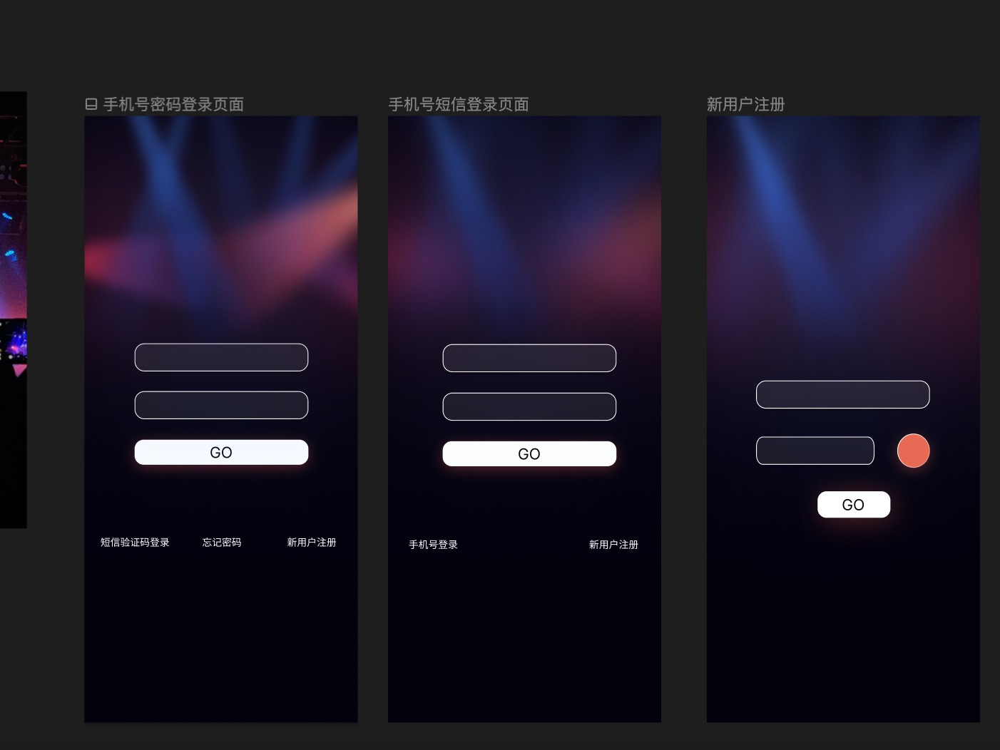

# 中期进度展示

[TOC]

## 总体项目进展

### 已完成

#### 需求分析

完成了需求调研，用例分析、功能性需求与非功能性需求分析，详见 [**需求分析文档**](../../softwareDocs/Requirement1/需求规约_v1.0.0.md)

#### 数据库设计及搭建

初步完成关系型数据库设计，共计13个实体表及1个关系表，具体表的设计参见 [**表的设计文档**](./table-design.md)

完成关系型数据库的部署，可以通过主机名 `124.220.158.211` 及端口号 `3306` 访问到 `ticket` 数据库服务

#### 后端框架搭建

初步完成了后端用户服务的SpringBoot框架搭建，完成SpringBoot各层示例代码，并配置SpringSecurity以及Jwt鉴权

各层级组织如图所示：

项目启动如图所示：

### 正在进行

#### Api设计及实现

目前已经围绕用户 `user` 以及演出 `show` 资源进行了Rest风格的相关Api的设计，具体用法参考 [**Api设计文档**](./api-design.md)

#### 页面设计

前端目前已经完成注册及登录页面的设计及编写，正在进行其余页面的设计中

[TODO：重新插图]

## 当前技术栈

- 前端框架：Vue3 `5.0.8`
- 后端框架：SpringBoot `2.7.5`
- 微服务通信及治理：SpringCloud `2.1.2`
- Api数据交互：Axios
- 服务部署：Docker `20.10.5`
- Web代理服务器：Nginx `1.23.2`
- 数据库：Mysql `8.0.31`，MongoDB
- 版本管理工具：Github/Git
- 集成服务：GitHub Action
- 团队协作工具：YouTrack

## 接下来的计划

- 对于目前设计的Rest风格的Api，我们决定使用HATEOAS风格进行重构，进一步减少client和server的依赖关系
- 考虑规模较大负载较高的情况下，对已有设计进行分库、分表
- 对于座位信息这种半结构化的数据，我们决定采用MongoDB这种非关系型数据库进行存储
- 熟悉SpringCloud的特性及用法

## 面临的问题和挑战

#### 多端问题

受到票务系统应用场景多样性的影响，我们希望能尽量实现Web端、移动端App及各个平台小程序等多端开发。

#### 重复调用问题

按照现有微服务划分，会出现支付、订单、购物车、转卖、库存等服务互相之间高频重复调用的问题，可能需要解耦重构这些服务的具体功能