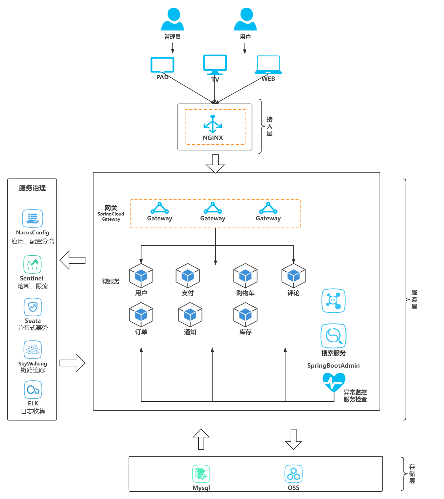

## 线上购票平台

### 项目背景

近年来，随着经济的不断发展，大众的审美品味也在不断提高，越来越多的线下娱乐形式逐渐进入大众的视野中，如音乐剧、话剧、演唱会、体育比赛等。

与此同时，不同剧院、不同发行方的作品往往呈现出分散宣传、分散发售、线下发售的形式，有时观众需要关注微信公众号、微博、剧院官网等多个渠道，获取售票信息，这给观众带来了十分不便的服务体验。同时有的用户会出现因个人愿意或疫情等不可抗力导致买票后无法到场的情况，本网站会提供供用户之间的票务交流服务，可以实现用户间转票，更方便安全。

针对以上痛点，本项目将搭建一个线上购票平台，为各类线下娱乐形式提供售票服务，为用户提供演唱会、话剧、体育比赛、单口喜剧、Livehouse等品类的购票服务，支持活动宣传、查看活动的详细信息、选座、订票、出票等功能。

### 项目功能

本项目为采用以API主导连接的微服务架构搭建而成的现代Web网站

为用户提供各项演出、赛事等活动的票务信息服务：

- 检索并浏览各项票务信息
- 将心仪的票添加到购物车，支付并跟踪订单
- 对已完成的订单做出评价
- 用户转卖已有票
- 在论坛进行讨论

同时平台管理员可以对平台信息进行处理：

- 添加、删除、修改和查询订单
- 处理用户评论和订单
- 管理论坛和用户的票务转卖

由于是面向服务架构的API后端，我们同样会开放API供其他用户使用：

- 支持不同的编程语言和框架
- 支持独立或分布式部署

### 项目架构

### 技术栈

- 前端框架：Vue3
- 后端框架：SpringBoot
- 微服务通信及治理：SpringCloud
- Api数据交互：Axios
- 服务部署：Docker
- Web代理服务器：Nginx
- 数据库：Mysql
- 版本管理工具：Github/Git
- 团队协作工具：YouTrack

### 时间线

第一步：明确需求，设计技术栈和项目的逻辑架构

第二步：建立开发环境，设计API

第三步：平行开发前后端

第四步：集成测试

第五步：完成制作最终演示，完善项目和开发手册等

